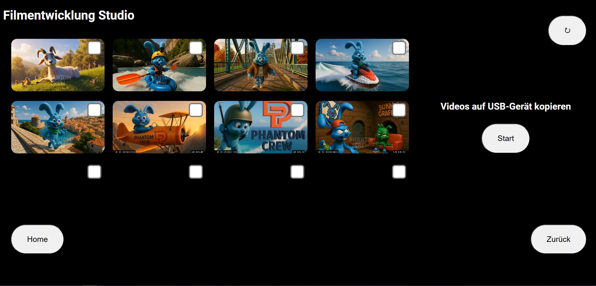
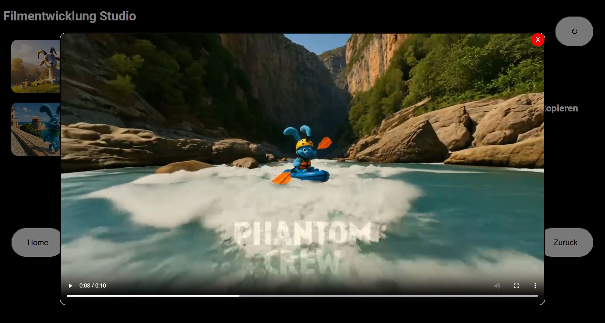

# 📼 Video Kiosk to USB Copier
This project is a **self-service video export kiosk system** that allows users to select and copy video files to a USB drive via a touchscreen interface. It's designed for exhibitions, media labs, or public installations where users can take selected video files with them — no technical knowledge required.

---

### 🧩 Features

* ✅ **Touch-friendly web interface** in fullscreen kiosk mode
* 🎞️ **Video previews** and checkboxes for selection
* 💾 **Export selected files** to a USB drive
* 🔊 **Auditory confirmation** (sound) when transfer is complete
* ⏏️ **Auto-eject USB stick** after successful copy
* 🚧 **Progress bar** and real-time status updates
* 🛡️ Error handling for missing files and device detection

---


### 🖼️ Interface Preview
[Try Demo: Video-Kiosk-2-USB-Copier](https://phantomcrew-de.github.io/Video-Kiosk-2-USB-Copier/Frontend/dwvid.html)
<table>
  <tr>
    <td align="center" width="25%">
      <br>
      <strong>Interface (Chromium)</strong>
    </td>
    <td align="center" width="25%">
      <br>
      <strong>Interface (Chromium)</strong>
    </td>
  </tr>
</table>

### 🛠️ How It Works

#### 1. `dwvid.html`

A fullscreen HTML interface running in Chromium's kiosk mode. It:

* Displays videos from a local directory
* Lets users select videos with checkboxes
* Creates a `selected_videos.txt` file containing chosen filenames when "Start" is clicked

#### 2. `start_kiosk_and_copy_2.sh`

A Bash script that:

* Launches the HTML file in Chromium kiosk mode
* Monitors for the presence of `selected_videos.txt`
* Waits for a USB drive to be inserted
* Copies the selected videos from a predefined folder (`/home/kiosk/Kiosk`) to the USB drive
* Displays a graphical progress bar using `yad`
* Plays a success sound and ejects the USB stick automatically

---

### 📡 Server Integration

Your videos are managed remotely, the two scripts in the `Server/` folder provide **automatic or manual synchronization** of video files from a network source (e.g. an SMB share or mounted NAS).

#### `Videos2kiosk.sh`

A **manual sync script** that copies new video files from a server directory (source) to the local kiosk directory `/home/kiosk/Kiosk`. Ideal for one-time updates or remote management.

#### `Videos2kiosk_auto.sh`

Same logic as above but designed for **automated syncing**, e.g., when used in a scheduled task (`cron`, `systemd timer`). It ensures that the kiosk is always up to date with the server content — without user interaction.

---

### 🕒 Example Cronjob (for auto sync)

To run `Videos2kiosk_auto.sh` every hour:

```bash
0 * * * * /home/kiosk/Server/Videos2kiosk_auto.sh >> /home/kiosk/Server/sync.log 2>&1
```

This ensures your kiosk always has the latest content from the server.


---

### 📂 Folder Structure


```
/home/kiosk/
├── Kiosk/                        # Local video folder shown in the HTML UI
├── Kiosk/dwvid.html              # Kiosk HTML interface
├── success.wav                   # Sound notification after successful copy
├── selected_videos.txt           # Auto-generated list of selected videos
├── copy_videos.log               # Log file for copy operations
├── start_kiosk_and_copy_2.sh     # Main script to run the kiosk and handle USB copy
└── Server/
    ├── Videos2kiosk.sh           # Manual sync script for updating video files from a server
    └── Videos2kiosk_auto.sh      # Auto-sync version for scheduled use (e.g., via cron)
```
---

### 🚀 Getting Started

1. Install `Chromium`, `yad`, `aplay`, and `flatpak` support if needed
2. Set up the `Kiosk/` folder with your videos
3. Place the scripts in `/home/kiosk/`
4. Make the Bash script executable:

   ```bash
   chmod +x start_kiosk_and_copy_2.sh
   ```
5. Run the script:

   ```bash
   ./start_kiosk_and_copy_2.sh
   ```

---

### 📦 Requirements

* Linux (Debian-based recommended)
* Flatpak Chromium or regular Chromium install
* `yad` for graphical dialogs
* `aplay` for audio notification
* USB automount enabled under `/media/kiosk/`

---

### 🧠 Use Cases

* Museums and media exhibitions
* Public interactive terminals
* Studios allowing guests to take footage
* Educational settings with offline video sharing
  
---


## 📄 License

This project is licensed under the GNU General Public License v3.0 (GPL-3.0).  
You are free to use, modify, and distribute it — as long as you share your changes under the same license.

### 🚶 Credits

Originally developed for **Phantomcrew**'s corporate identity needs, now open for your adaptation.

### 🤝 Author

Made with ❤️ by Julius – [phantomcrew.de](https://phantomcrew.de/)

